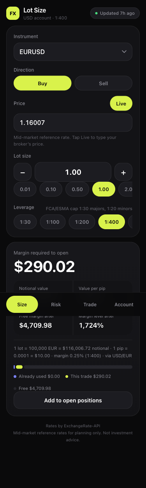

# Lot Size — FX Position Calculator

A mobile-first PWA that answers the question *"how much do I need to open this trade?"* — and the
more useful one behind it, *"how big should this trade actually be?"*

No build step, no dependencies, no backend, no accounts. Six hand-written ES modules and a
service worker.



## What it does

| Tab | Answers |
|---|---|
| **Size** | Instrument, direction, price, lots → **notional value**, **margin required**, **pip value**, free margin and margin level after the trade |
| **Risk** | Balance, risk %, stop distance, spread, commission → **the lot size to actually use** |
| **Trade** | Entry / stop / target → P/L at each, **reward:risk**, margin level if the stop is hit |
| **Account** | Balance, currency, leverage, stop-out, open positions → used margin, free margin, **margin level, pips to stop-out** |

28 FX pairs, 6 indices, 3 energies. Every contract specification is editable, because they differ
between brokers.

## The parts that are easy to get wrong

**FX and CFDs need different margin formulas.** An FX contract is denominated in its *base*
currency, so margin is `lots × contractSize / leverage` converted to the account currency — which
is why USDJPY on a USD account needs exactly $250 at 1:400 no matter where the price is. Indices
and energies have no base-currency leg; they are priced directly in their settlement currency, so
margin is `lots × contractSize × price / leverage`. Applying the FX formula to US30 reports
**$0.0025** of margin instead of $96.25.

**Conversion triangulates through a USD anchor at full precision.** Chaining a pre-rounded cross
quote drifts — EURGBP at 2 lots lands on 216,999.9978 instead of exactly 217,000.

**P/L converts at the closing rate**, matching MT4/MT5. A 0.20-lot USDJPY trade from 157.000 to
158.200 is $151.71, not the $152.87 an entry-rate conversion gives.

**Ambiguous numbers are refused, not guessed.** `parseFloat("1,085")` returns `1`, and stripping
the comma returns `1085` — both silent 1000× errors on a price field. "1,085" means 1.085 to a
German and 1085 to an American, so the app rejects it and asks for a dot.

**Risk sizing always rounds down** to the lot step, and folds in spread and commission. A 10-pip
stop on a 1.2-pip spread with $7/lot commission is a **1.19%** risk, not 1% — so the honest answer
is 0.42 lots, not 0.50.

**It never recommends a position you cannot fund.** Sizing is capped by free margin.

## Assumptions worth knowing

- **Margin is held at the opening rate**, which is how most retail platforms behave. If your broker
  revalues margin live, the stop-out distance is slightly conservative (486.4 pips vs 487.0 on the
  reference case).
- **Rates are daily mid-market reference rates**, not a live feed, and not your broker's quote.
  Fine for sizing; override the price to match a real fill.
- **Indices and energies have no rate-feed price** — enter your broker's quote.
- Swap/rollover is not modelled.

## Running it

```bash
python3 -m http.server 5173
```

Then open `http://localhost:5173`. A server is required: ES modules and service workers do not
work over `file://`.

## Tests

```bash
node --test 'test/*.test.mjs'
```

44 tests, zero dependencies. The reference values were derived independently five times before any
test was written and were unanimous; the edge suite covers the conversion shapes a plausible-but-
wrong engine still passes — multiplying by USDJPY, two-hop crosses, and a non-USD-settled index on
percentage margin.

## Files

| File | Role |
|---|---|
| `calc.js` | Pure math. No DOM, no I/O. |
| `instruments.js` | Contract specifications (all defaults, all overridable) |
| `rates.js` | Rate fetch, validation, caching |
| `state.js` | Persisted settings and derived model |
| `views.js` | Rendering |
| `app.js` | Boot, controls, input binding |

## Security

Client-side only; nothing leaves the device but the rate request. The CSP is `default-src 'none'`
with Trusted Types enforced, so `innerHTML` throws rather than becoming an XSS sink — service
worker registration goes through a policy that allow-lists exactly one file. Rate payloads are
validated (shape, ISO codes, magnitude bounds, USD anchor) before any value is used. CI enforces
the no-dependency rule, greps for unsafe DOM sinks, and runs CodeQL.

Two headers a static host should add, which a `<meta>` tag cannot deliver:

```
Referrer-Policy: no-referrer
Content-Security-Policy: frame-ancestors 'none'
```

Rates by [ExchangeRate-API](https://www.exchangerate-api.com), falling back to
[Frankfurter](https://frankfurter.dev).

---

Mid-market reference figures for planning. Not investment advice.
